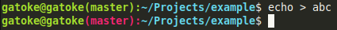

# git-bash-prompt
Bash script adding git status to prompt in terminal

Copy everything from the _script_ to your ~/.profile file.

To make this work in IntelliJ's (or other IDE's) terminal go to:
_Settings_ -> _Tools_ -> _Terminal_ 
and set shell path to `/bin/bash --rcfile ~/.profile`

This is just my customization for Ubuntu 18.04 of https://coderwall.com/p/pn8f0g/show-your-git-status-and-branch-in-color-at-the-command-prompt
